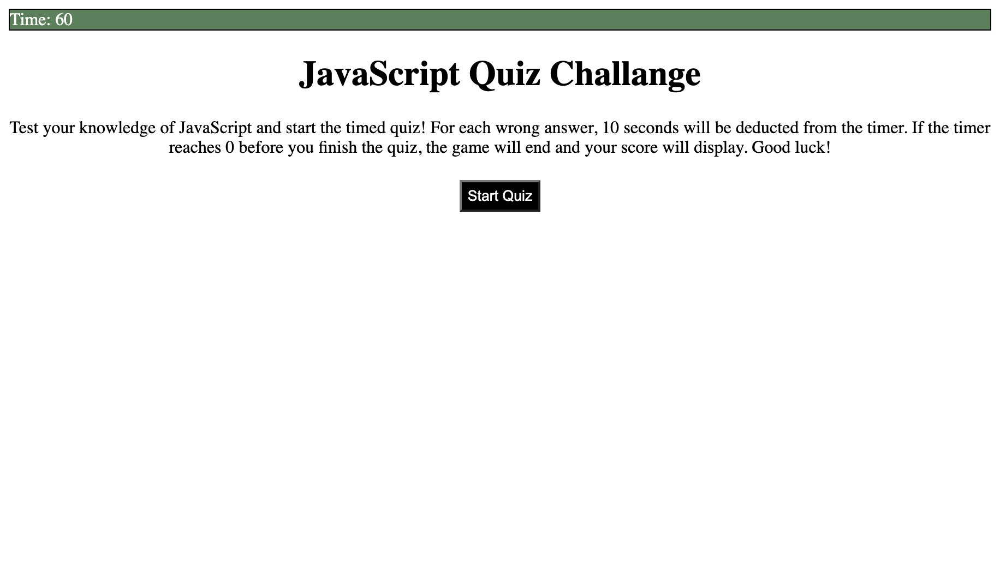
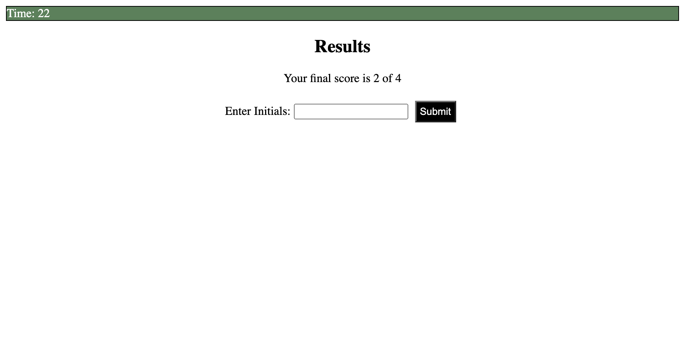
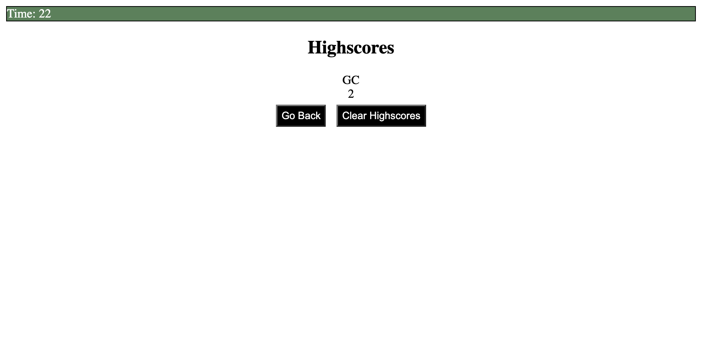

# 04-JavaScript-Code-Quiz

The purpose of this code quiz is to test an individuals knowledge of basic JavaScript knowledge.

## Overview

The quiz includes four questions that need to be answered within 60 seconds. Overall, this quiz is intended to test student learners of their JavaScript knowledge and improving what they don't know. 

In addition to helping others with their learning, I created this code quiz to further develop my JavaScript knowledge. A key takeaway from this project was how to create an HTML file that connected to code within a JavaScript file. It tested my ability to conceptualize how code interacts between files. I also learned how to hide and display HTML elements when the code is executed on a website.

In future iterations of this quiz I would like to add more questions and improve the design aspect of the quiz. 

To play this quiz, please [click here](https://glchavez.github.io/04-JavaScript-Code-Quiz/).

## Usage

To play this quiz, first click on the "Start" button within the home page of the quiz.

This will begin the timer, set at 60 seconds, and display the first question of the quiz. Each time you get a question wrong, the timer is deducted by 10 seconds. If the timer hits zero or you asnwer all questions, the results page is displayed.

The results page shows the number of questions you got correct and lets you log your score and initials to be displayed on the highscore page.

The highscore page displays your score and initials. You can push the "Clear Highscores" button, which will clear the listed scores and initials. To restart the quiz, simply push the "go Back" button and this will start the questions and timer.

## Credits

I would like to provide credit to [The Denver Univeristy Coding Bootcamp](https://bootcamp.du.edu/coding/) for providing me with the materials, intstructions, and one-on-one assistance to perform this project.

Recognition is provided to [W3Schools](https://www.w3schools.com/) for providing me with resources to better understand Java Script concepts and how to implement them and how to show/hide HTML elements on a website. I would also like to give credit to [Stack Overflow](https://stackoverflow.com/questions/44314897/javascript-timer-for-a-quiz) for providing me with example code on how to create a simple timer for my quiz.

## License

MIT License

Copyright &copy; 2021 Giovany Chavez

Permission is hereby granted, free of charge, to any person obtaining a copy
of this software and associated documentation files (the "Software"), to deal
in the Software without restriction, including without limitation the rights
to use, copy, modify, merge, publish, distribute, sublicense, and/or sell
copies of the Software, and to permit persons to whom the Software is
furnished to do so, subject to the following conditions:

The above copyright notice and this permission notice shall be included in all
copies or substantial portions of the Software.

THE SOFTWARE IS PROVIDED "AS IS", WITHOUT WARRANTY OF ANY KIND, EXPRESS OR
IMPLIED, INCLUDING BUT NOT LIMITED TO THE WARRANTIES OF MERCHANTABILITY,
FITNESS FOR A PARTICULAR PURPOSE AND NONINFRINGEMENT. IN NO EVENT SHALL THE
AUTHORS OR COPYRIGHT HOLDERS BE LIABLE FOR ANY CLAIM, DAMAGES OR OTHER
LIABILITY, WHETHER IN AN ACTION OF CONTRACT, TORT OR OTHERWISE, ARISING FROM,
OUT OF OR IN CONNECTION WITH THE SOFTWARE OR THE USE OR OTHER DEALINGS IN THE
SOFTWARE.